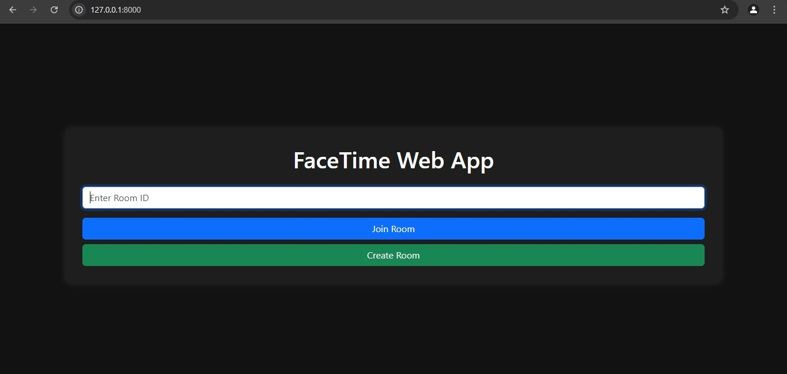
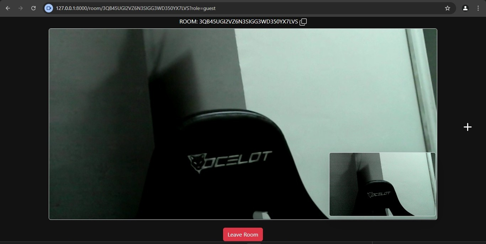

# FaceTime Web App (WebRTC + FastAPI)

This is a simple FaceTime-style web app that allows users to create and join video call rooms using WebRTC. The app is built with:
- **FastAPI (Python)** for signaling and serving templates
- **TypeScript** (compiled to JavaScript) for frontend logic
- **Bootstrap** for styling
- **WebSockets** for real-time communication

## Preview
### Home Page

### Room Page


## Installation & Setup

First, clone the repository:
```sh
git clone https://github.com/xjohnnygx/FaceTime-app.git
cd FaceTime-app
```

### Option 1: Run with Docker
Ensure you have **Docker** and **Docker Compose** installed. If you don't, download them here:
- [Docker Engine & Docker Compose](https://www.docker.com/get-started/)

Then, run:
```sh
docker-compose up --build
```

### Option 2: Run Locally (Python)
Ensure you have **Python 3.12.2+** installed. If not, download it here:
- [Python Downloads](https://www.python.org/downloads/)

Then, proceed with the following steps:
```sh
python -m venv venv
source venv/bin/activate  # On Windows use: venv\Scripts\activate
pip install -r requirements.txt
```

Start the FastAPI server:
```sh
python main.py
```

## Usage
1. Open `http://localhost:8000/` on the host device to create or join a room.
2. Copy the room ID from the interface.
3. If joining from another device on the **same local network**, find the host device's local IP address:
   - On Windows, run `ipconfig` and look for the IPv4 address.
   - On Mac/Linux, run `ifconfig` or `ip a` and check the local network adapter.
4. On the second device, open `http://<HOST_IP>:8000/` in a web browser.
5. Enter the room ID and join the video call.
6. If you don't have another device, simply open a new tab in your browser and go to `http://localhost:8000/` again to simulate a second user.


## License
This project is licensed under a **restricted license**. You are allowed to clone and test the app, but modifying, distributing, or using it for commercial purposes is strictly prohibited. See the [LICENSE](LICENSE) file for details.